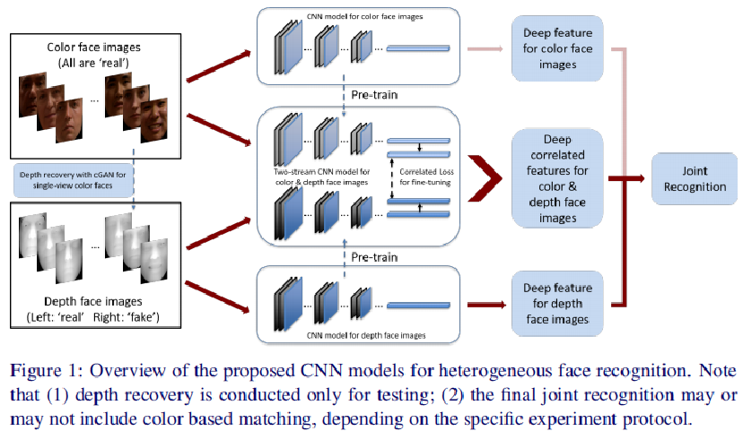
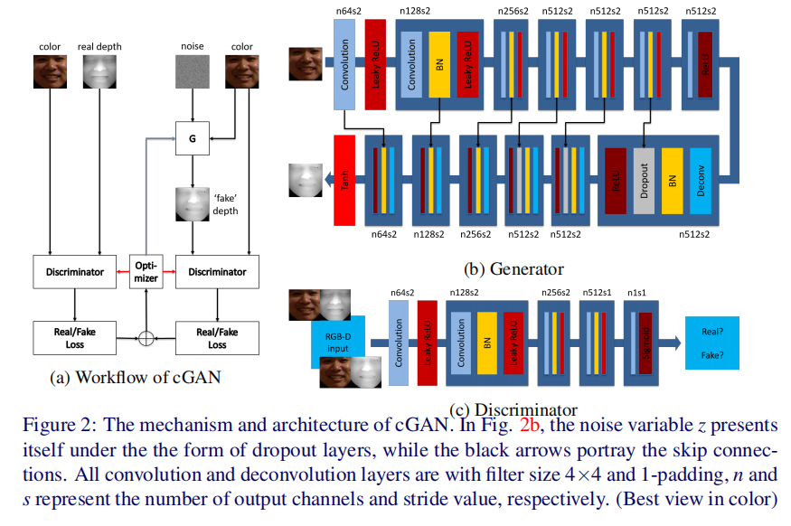
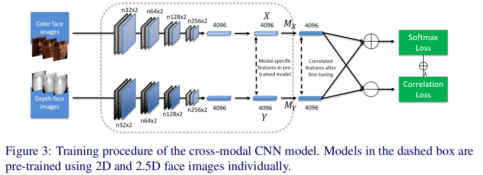
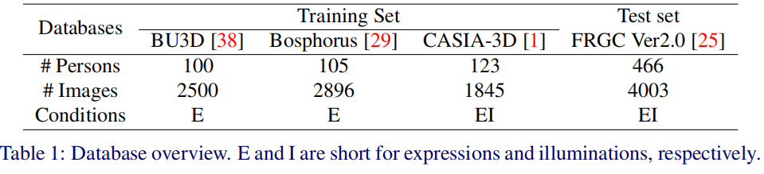

# [论文笔记]Improving Heterogeneous Face Recognition with Conditional Adversarial Networks

## 1. Abstract

彩色图像（color image）和深度图像（ depth image）之间的异类人脸识别（Heterogeneous face recognition）是现实应用中的一种 much desired 的能力。在本文中，我们提出了一种跨模式的深度学习方法（a cross-modal deep learning
method），作为解决这一挑战的有效方法。具体来说，我们从学习两个卷积神经网络(CNN)开始，分别提取 2 D 和 2.5 D的人脸特征。一旦经过训练，它们就可以作为另一个two-way CNN的预训练模型，探索颜色和深度之间的关联部分，以便进行异质匹配。我们的方法还利用条件生成对抗性网(cGAN)对单色图像进行了精确的深度图像重建，通过融合多模态匹配结果，进一步提高了识别性能。

请注意，阻碍我们利用探测集深度信息的所有困难都来自于3D数据的获取和注册。直观地说，如果能从彩色图像中准确、有效地重建深度图像，这些问题就能立即得到解决。尽管已有许多关于从单个图像恢复形状的工作，它们大多依赖于三维模型的拟合，这是一种耗时的方法，在landmarks定位不准确的情况下容易出现精度不高的问题。由于生成模型的发展非常迅速，特别是最近才引入的生成对抗性网络(Gan)及其条件变化(cGAN)，我们使用cGAN实现端到端深度面恢复，以强制生成真实的图像。

**we list our contributions as follows:**

1. 一种新的基于cGAN的深度面恢复(depth face recovery)方法,以及使用Auto-encoder with skip connections来提高了重建深度图像的质量。

2. 我们首先单独训练两个区分性的cnn，目的有两个：一是提取彩色图像和深度图像的特征，二是为跨模态2D/2.5D cnn模型提供预先训练的模型。

3. 一种新的异构人脸识别流水线，融合了多模态匹配分数，达到了最先进的识别效果。

   

## 2. Depth Face Reconstruction

### 2.1  Problem Formulation

传统GAN公式：
$$
L_{GAN}(G,D)=E_{x\sim P_{data}(x)}[logD(x)]+E_{z\sim p_z(z)}[log(1-D(G(z)))]
$$
GaN的优点是可以利用随机分布的噪声矢量生成真实感图像，这对于无监督学习至关重要。但是，请注意，在我们的脸恢复场景中，训练数据包含图像对{x，y}，其中x和y分别引用deep face 和color face，它们之间具有一对一的对应关系。事实上，y可以作为生成任务的先验参与到模型中，这一事实导致了GaN的条件变体，即cGAN。
$$
L_{cGAN}(G,D)=E_{x,y\sim P_{data}(x,y)}[logD(x,y)]+E_{z\sim p_z(z),y\sim p_{data}(y)}[log(1-D(G(z|y),y))]
$$
此外，为了保证图像生成输出g(z|y)与ground truth x之间的像素相似性(pixel-wise similarity)，我们随后以 L1 distance的形式对生成器施加了一个重构约束:
$$
L_{L1}(G)=E_{x,y\sim p_{data}(x,y),z\sim p_z(z)}[||x-G(z|y)||_1]
$$
在使用标量η平衡损失的情况下，对上述两个损失用最小最大值函数表示综合目标(comprehensive objective)：
$$
min_G max_D[L_{cGAN}(G,D)+ηL_{L1}(G)]
$$
请注意，cGAN本身很难生成指定的图像，仅使用$L_{L1}(G)$ 就会造成模糊，这种联合损失成功地利用了它们的互补优势。

### 2.2  CGAN Architecture

**Generator:**

作为标准的generative model，自动编码器(auto-encoder（AE）) 及其变体]的架构被广泛用作过去的cGAN中的G。然而，传统的AE的缺点是明显的：由于它们的降维能力，当图像通过编码器中的各层时，很大一部分low-lever信息(如精确定位)被压缩。为了解决这个有损压缩问题，我们遵循U-net的思想，增加了skip connections，它直接将特征从编码器层转发到处于同一“级别”的解码器层。如图2(b)。

**Discriminator:**

我们采用 PatchGAN 作为鉴别器。在此模式中，没有实现fully connected layers，判别器输出2D图像，其中每个像素表示相对于原始图像上相应的补丁的预测结果。<u>然后对所有像素进行平均处理，以确定输入图像是“真实的”还是“假的”。</u>与像素级预测相比，PatchGAN 有效地集中在局部模式上，而全局低频正确性则由公式(3)中的 L1 loss来实现。

## 3  Heterogeneous Face Recognition

从彩色图像中重建deep face使我们能够最大限度地利用gallery和probe中的形状信息，这意味着我们可以单独学习cnn模型，提取深度图像的判别特征，并将初始的跨模态问题转化为多模态问题。然而，heterogeneous matching仍然是我们工作中的另一个挑战，下面我们将演示如何制定和解决这个问题。

### 3.1 Unimodal learning

我们用于Casia-WebFace上的彩色和灰度图像从头开始训练两个CNN, and further fine-tune the grayscale based model
with our own depth images。这两个CNN模型有两个目的：分别提取2D和2.5D特征，并为随后的cross-modal learning提供预先训练的模型。

### 3.2 Cross-modal learning

一旦对两个CNN模型进行了训练，就可以在最后一个完全连接的层之后获得特定于模态的表示{X，Y}。注意，双流跨模态cnn模型的每个输入都是具有身份对应的2D+2.5D图像对，有一种直觉是合理的，即X和Y共享共同的模式，这也有助于将它们分为同一类。

为了探索共享鉴别特征（shared and discriminative feature），我们需要联合监督( joint supervision)，以加强**correlation**和**distinctiveness**(独特性)。所以我们在X和Y后面应用两个线性映射，由$M_X$和$M_Y$表示。（如图3）

1. 为了确保新特性之间的相关性，要求它们尽可能接近，这是通过最小化它们在特征空间中的距离来限制的：

$$
L_{corr}=\sum_{i=1}^{n}||M_XX_i-M_YY_i||_F^2
$$

其中n表示batchsize的大小。$||·||_F$代表Frobenius norm。

2. 如果仅使用上述loss监测信号，则模型只需学习MX和My的零映射，因为在这种情况下，$L_{corr}$将稳定为0。为了避免这种棘手的情况，我们将两个输出计算平均以获得一个新的feature，从而可以计算分类损失（classification loss）。
   $$
   L_{hfr}=L_{softmax}+\lambda L_{Corr}
   =-\sum_{i=1}^{n}log\frac{e^{W_{c_i}^T(M_XX_i+M_YY_i)/2+b_{c_i}}}{\sum_{j=1}^m e^{W_j^T(M_XX_i+M_YY_i)/2+b_j}}+\lambda \sum_{i=1}^{n}||M_XX_i-M_YY_i||_F^2
   $$
   其中$c_i$代表第i个图像对的ground truth 类的标签，

### 3.3  fusion

为了突出该方法的有效性，我们采用4096-d隐层特征的余弦相似度作为匹配分数。对于分数融合阶段，所有分数都被归一化为[0，1]，并通过一个简单的和规则(sum rule)进行融合。

## 4 Experimental Results

### 4.1 Dataset Collection

如表1所示，三个大型和公开的3D人脸数据库作为培训集被收集起来，并在另一个数据集(FRGC Ver2.0)上进行性能评估,这意味着训练和测试集之间没有重叠。

### 4.2 Preprocessing

为了从原始的3D形状生成2.5D的距离图像，处理：

1. 如果点云(point cloud)是预先排列在网格中的，我们可以进行直接投影。——> Bosphorus/FRGC
2. 采用简单的Z-buffer算法。——> BU3D/CASIA3d

> 1. to generate 2.5D range image from original 3D shape
> 2. resize and crop the original image pairs to 128×128
> 3. fixing their interocular distance(眼间距离) to a certain value

