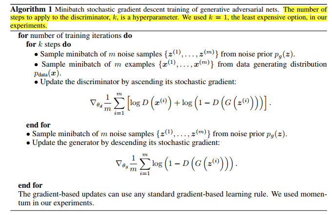

# GAN

## [GAN(Generative Adversarial Nets)](https://arxiv.org/abs/1406.2661)

判别网络的性能越来越好，甚至比生成器网络的表现还要好，但是判别器网路是 up to down 的，具有全局性却缺乏细节性。而生成器网络是 bottom to up 的，细节表现很好，但是全局的表现并不好。

于是作者将生成网络和判别网络进行了结合。

使用生成网络来生成一个图片，用判别网络对图片进行判别，它是属于生成网络合成的人造图像还是真实图像。用判别网络得到的结果来优化生成网络，用生成网路得到的结果再来优化判别网络。

这种就可是最终生成网络得到的图片越来越接近于真实图片，使得判别器真假难辨。

下面给出迭代训练的公式：

