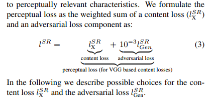
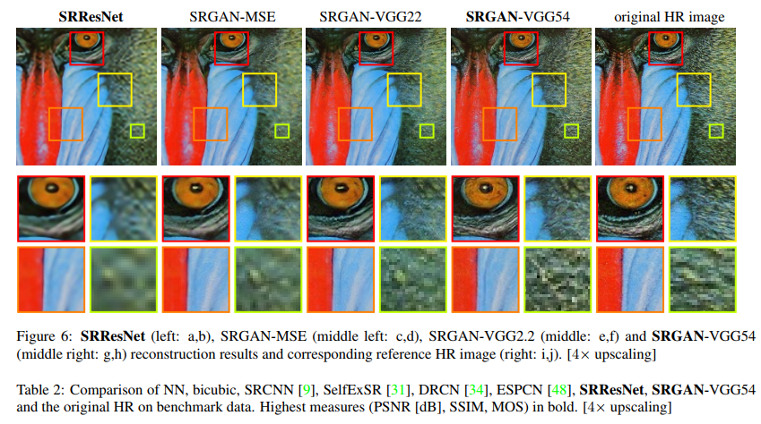

# Super Resolution

## [SRGAN(Photo-Realistic Single Image Super-Resolution Using a Generative Adversarial Network)](https://arxiv.org/abs/1609.04802)

在以往的超分辨率重建任务中，大家都使用最小化超分辨后的生成图像与真实高分辨率图像之间的MSE和最大化信噪比的方式来做评估，MSE的公式为：

****

但是，使用这种这种最小化逐像素的相似性差异来进行优化的方法存在局限性，我们在最小化MSE的时候，也同时平均掉了高频的结构细节，使得图像的重建结果过于平滑（磨皮磨过头了）。而人的视觉感官对于图像的高频信息比较敏感，高频信息的损失会使得图像的视觉效果变差。同样， 更高的信噪比也不能说明重建得到的超分辨图像就一定是更好的结果。

作者还给出一张对比图来说明使用以往的传统最小化MSE评估结果的差距：

其中上图中的左二是使用ResNet以MSE作为评估结果得到的，左三是使用GAN以作者自己提出的感知损失函数作为评估结果得到的。虽然这并严格满足控制变量的对比实验原则，但是也可以意会一下使用MSE过度磨皮的结果。

于是乎，作者自己提出了一种新的感知评估函数，用VGG based内容损失函数来代替MSE损失，同时结合了当下流行的GAN网络，来提高图像重建结果与原图之间的逼真度：

这个损失函数主要由内容损失函数和对抗损失函数组成。其中内容损失函数如下：

对抗损失函数如下：

作者除了在提出了一个使用VGG based的感知函数以为，还使用了当下流行的GAN模型，下面是作者基于ResNet搭建的GAN网络：

在生成网络上，作者使用了B个同样结构布局的残差块，然后使用了64个3*3的卷积核做卷积，再通过一个batch normalization层，用Parametric ReLU作为激活函数。在此之后，作者又加了两个同样的之前训练好的sub-pixel卷积层。

在辨别网络上，作者使用了α=0.2的Leaky ReLU，并且没有使用pooling。然后用了8个一样的3*3卷积核的VGG网络层，每一层使图像特征数量扩大一倍。最后使用了两个全连接层，一个最终的Sigmoid激活函数作为输出。

在完成了这些工作以后，作者还对评估函数所用的VGG网络的深度进行了探讨：

作者认为，网络越深其超分辨重建的效果应该就越好。在他做的该组对比实验中，作者认为使用4个卷积层和5个pooling层得到的效果最佳。

当然了对于GAN里面的生成网络，作者认为使用ResNet的网络层数越深得到的效果也应该更好，但是这会带来更长的训练时间和更多的复杂的难以训练的高频参数。

另外，作者还对未来的工作进行了展望，他认为人的感官结果不能单纯的使用信噪比和单纯的数学公式来表示，他认为未来应该专注于在提出更好的感官评估函数。

